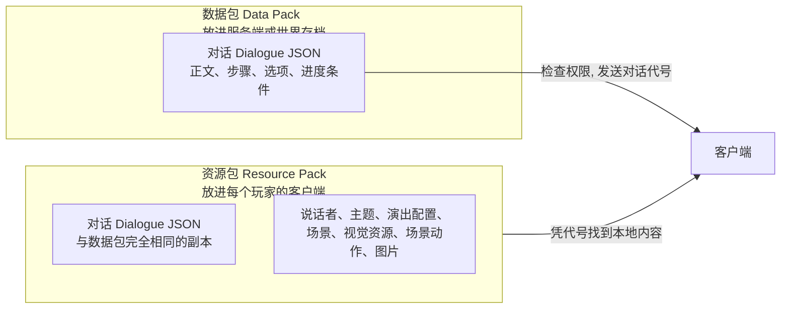

# 双端分工：为什么对话要放两份

## 游戏的两种情况

Minecraft 里一段对话的运行分成两部分：

- **服务端**（运行世界的电脑，单人游戏时就是你自己）负责判断：这段对话存不存在、玩家有没有资格进入、进度节点是什么状态。
- **客户端**（玩家看画面的电脑，单人游戏时还是你自己）负责显示：文字、人物图、背景、动画和界面。

多人游戏中这两部分可能在不同的电脑上。MaiMai Dialogue 打开对话时，服务端只把**对话的代号**发给客户端，不发送文字和画面内容。客户端必须在自己本地（资源包）里找到代号对应的文件，才能显示出来。

这就是为什么"服务端允许了但客户端没有画面"或"客户端有选项但服务端找不到"这类问题会发生：两边内容没对上。

## 双端分工图

## 每个文件该放哪

| 文件 | 放数据包 | 放资源包 | 说明 |
|---|:---:|:---:|---|
| 对话（Dialogue）JSON | 是 | 是 | **只有它需要两份**，且内容必须一致 |
| 说话者（Speaker） | 否 | 是 | |
| 主题（Theme） | 否 | 是 | |
| 演出配置（Presentation） | 否 | 是 | |
| 场景（Scene） | 否 | 是 | |
| 视觉资源（VisualAsset） | 否 | 是 | |
| 场景动作（SceneAction） | 否 | 是 | |
| 图片（PNG） | 否 | 是 | |

## 两端不一致会看到什么

- **数据包有、资源包没有**：命令返回"已发送"，但客户端没有任何反应。
- **资源包有、数据包没有**：服务端认为这段对话不存在，命令直接失败。
- **两份内容不同**：服务端按数据包的版本检查条件和选项，客户端按资源包的版本显示。可能出现"客户端显示了选项、点击后服务端拒绝"这类对不上的现象。

修改对话后，记得同时更新两份文件，并分别执行 `/reload`（服务端）和 `F3 + T`（客户端）。

## 下一步

对话文件具体放在哪个目录、代号怎么写，见[资源路径与 ID](../reference/resource-paths.md)。发布时如何打包交付，见[双端发布](../publish/client-server.md)。
