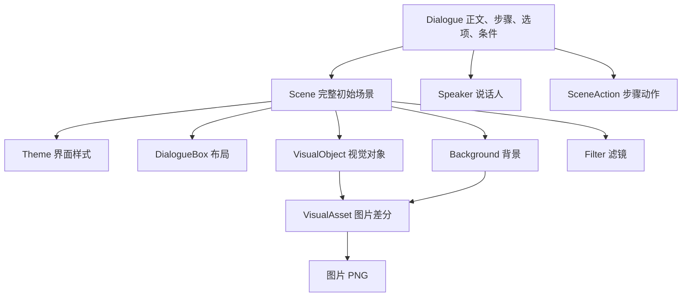

# 概念总览

这个 MOD 做的事可以分成两半：

- **讲什么**：对话的内容，包括正文文字、步骤、选项和进度条件。
- **怎么显示**：画面和界面长什么样，包括背景图、人物图、动画、对话框外观。

内容放在"对话"文件里，显示方案放在 Scene 中。下面这张图是全部资源类型之间的关系，先整体看一遍，再逐个看说明。

## 资源关系图

## 每种资源是做什么的

| 资源类型 | 放在哪 | 做什么用 | 什么时候不需要建它 |
|---|---|---|---|
| 对话（Dialogue） | 资源包 **和** 数据包 | 正文、步骤、选项、进度条件。每段对话都必须有 | 无，每个对话都必需 |
| 说话者（Speaker） | 资源包 | 一个名字，显示在文字上方 | 对话不显示名字时 |
| 主题（Theme） | 资源包 | 对话界面的外观：颜色、字号、按钮样式 | 使用默认外观时 |
| 场景（Scene） | 资源包 | 背景、视觉对象、滤镜、Theme 引用和对话框布局 | 使用内置空 Scene 时 |
| 视觉资源（VisualAsset） | 资源包 | 给一组图片（差分）起代号，供视觉对象引用 | 在 Scene 对象中直接定义图片差分时 |
| 场景动作（SceneAction） | 资源包 | 一段可复用的动画 | 动画直接写在对话里、不打算复用时 |
| 图片（PNG） | 资源包 | 背景和视觉对象实际显示的图片 | 没有画面资源时 |

## 场景如何生效

打开 Dialogue 后，客户端解析 Scene、Theme 和 VisualAsset，然后为本次播放创建独立 SceneState。Step 中的动作修改播放状态，不改写 Scene 资源。进入另一段 Dialogue 或重新进入当前对话时，会从引用 Scene 的初始配置重新开始。

Scene 不继承其他 Scene，Dialogue 不提供内联或局部覆盖。多个 Dialogue 可以引用同一 Scene；需要不同画面、主题或布局时，分别创建 Scene。

## 新手最常误解的 6 条行为规则

这些规则会让第一次使用的人遇到"看起来像 bug 的现象"，先在这里列出，详细说明在对应页面：

1. **按一次不换页是正常的**：有文字正在播放或动画正在播时，第一次推进只是把当前内容播完，第二次推进才翻页。详见[步骤与推进](../dialogue/steps.md)。
2. **动画数值是"挪多少"，不是"挪到哪"**：场景动作里的位置数值是相对当前状态的偏移，不是绝对坐标。详见[播放 SceneAction](../scene/actions.md)。
3. **第一个步骤自带一段默认淡入**：如果第一步没有给对话框写动画，系统会自动加一段 250ms 的淡入。详见[SceneAction JSON 参考](../reference/scene-action-json.md)。
4. **选项全部不满足条件时，推进等于返回**：所有选项都被隐藏时，玩家再次推进会按返回处理。详见[Dialogue JSON 参考](../reference/dialogue-json.md)。
5. **返回没有"上一页"概念**：子对话里返回 = 回到入口对话开头重新播；入口对话里返回 = 关闭界面。详见[会话与导航](./session.md)。
6. **一句话的打字机最多播 10 秒**：超过后文字会强制显示完整。详见[Dialogue JSON 参考](../reference/dialogue-json.md)。

## 文件位置速查

所有资源类型在资源包和数据包中的具体目录，见[资源路径与 ID](../reference/resource-paths.md)。每种资源类型对应的完整字段表，在左侧"参考资料"分组里按类型查找（Dialogue JSON、Scene JSON 等）。

## 下一步

- 想知道"为什么同一段对话要放两份文件"，看[认识 Dialogue](../start/dialogue.md)。
- 想知道"打开对话之后是怎么走的"，看[会话与导航](./session.md)。
- 想快速查某个词的意思，看[术语表](./glossary.md)。
