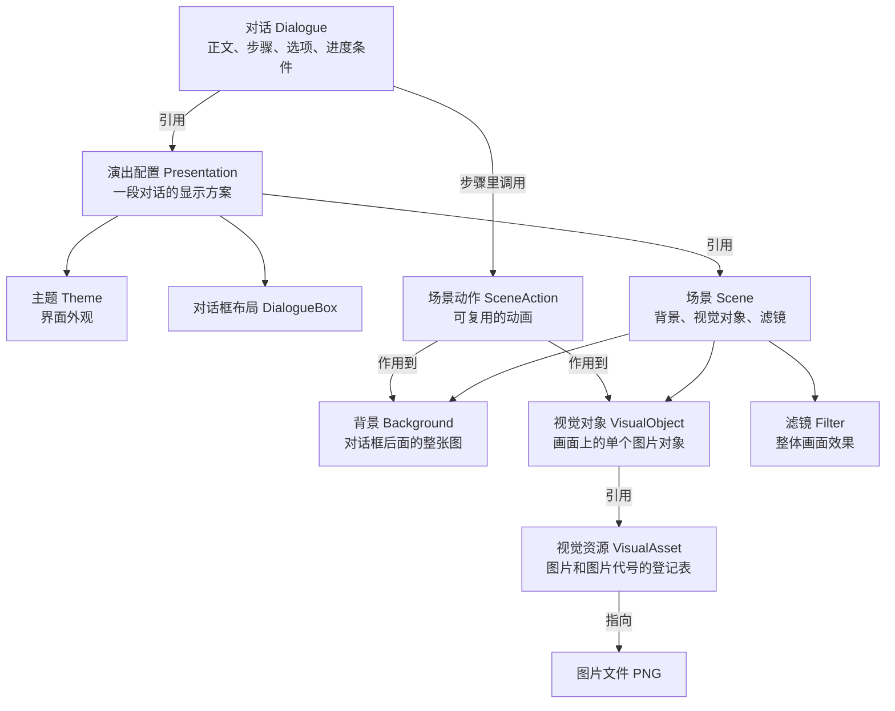

# 概念总览

这个 MOD 做的事可以分成两半：

- **讲什么**：对话的内容，包括正文文字、步骤、选项和进度条件。
- **怎么显示**：画面和界面长什么样，包括背景图、人物图、动画、对话框外观。

内容放在"对话"文件里，显示方案放在"演出配置"体系里。下面这张图是全部资源类型之间的关系，先整体看一遍，再逐个看说明。

## 资源关系图



## 每种资源是做什么的

| 资源类型 | 放在哪 | 做什么用 | 什么时候不需要建它 |
|---|---|---|---|
| 对话（Dialogue） | 资源包 **和** 数据包 | 正文、步骤、选项、进度条件。每段对话都必须有 | 无，每个对话都必需 |
| 说话者（Speaker） | 资源包 | 一个名字，显示在文字上方 | 对话不显示名字时 |
| 主题（Theme） | 资源包 | 对话界面的外观：颜色、字号、按钮样式 | 使用默认外观时 |
| 演出配置（Presentation） | 资源包 | 一段对话的显示方案：用哪个主题、哪个场景、对话框放哪 | 只有一段对话、显示方案直接写在对话里时（不用单独建演出配置文件） |
| 场景（Scene） | 资源包 | 一套可复用的画面组合：背景 + 视觉对象 + 滤镜 | 背景和对象直接写在对话里、不打算复用时 |
| 视觉资源（VisualAsset） | 资源包 | 给一组图片（差分）起代号，供视觉对象引用 | 图片只在对话里直接用一次时 |
| 场景动作（SceneAction） | 资源包 | 一段可复用的动画 | 动画直接写在对话里、不打算复用时 |
| 图片（PNG） | 资源包 | 背景和视觉对象实际显示的图片 | 没有画面资源时 |

::: tip 记住两个方向
- **引用方向**：对话 → 演出配置 → 主题 / 场景 / 对话框布局；场景 → 背景 / 视觉对象 / 滤镜；视觉对象 → 视觉资源 → 图片。
- **画图顺序**：每个资源类型只控制自己的那一块。改主题不会影响场景图片，改场景不会影响对话框外观。
:::

## 生效顺序：后写的盖过先写的

打开一段对话时，画面按下面的顺序套用：

```text
对话 → 演出配置 → 主题 → 场景 → 视觉资源 → 场景动作 → 画面和界面
```

其中有两处"覆盖"规则需要注意：

- 演出配置（或对话）里**直接写了**背景或滤镜时，会整个替换场景里的背景或滤镜。
- 视觉对象按名字合并：场景里定义了 `guide`，对话里也定义了 `guide`，则对话里的那份生效，其余对象保留。

## 新手最常误解的 6 条行为规则

这些规则会让第一次使用的人遇到"看起来像 bug 的现象"，先在这里列出，详细说明在对应页面：

1. **按一次不换页是正常的**：有文字正在播放或动画正在播时，第一次推进只是把当前内容播完，第二次推进才翻页。详见[步骤与推进](../dialogue/steps.md)。
2. **动画数值是"挪多少"，不是"挪到哪"**：场景动作里的位置数值是相对当前状态的偏移，不是绝对坐标。详见[播放 SceneAction](../scene/actions.md)。
3. **第一个步骤自带一段默认淡入**：如果第一步没有给对话框写动画，系统会自动加一段 250ms 的淡入。详见[SceneAction JSON 参考](../reference/scene-action-json.md)。
4. **选项全部不满足条件时，推进等于返回**：所有选项都被隐藏时，玩家再次推进会按返回处理。详见[Dialogue JSON 参考](../reference/dialogue-json.md)。
5. **返回没有"上一页"概念**：子对话里返回 = 回到入口对话开头重新播；入口对话里返回 = 关闭界面。详见[会话与导航](./session.md)。
6. **一句话的打字机最多播 10 秒**：超过后文字会强制显示完整。详见[Dialogue JSON 参考](../reference/dialogue-json.md)。

## 文件位置速查

所有资源类型在资源包和数据包中的具体目录，见[资源路径与 ID](../reference/resource-paths.md)。每种资源类型对应的完整字段表，在左侧"参考资料"分组里按类型查找（Dialogue JSON、Presentation JSON、Scene JSON 等）。

## 下一步

- 想知道"为什么同一段对话要放两份文件"，看[认识 Dialogue](../start/dialogue.md)。
- 想知道"打开对话之后是怎么走的"，看[会话与导航](./session.md)。
- 想快速查某个词的意思，看[术语表](./glossary.md)。
