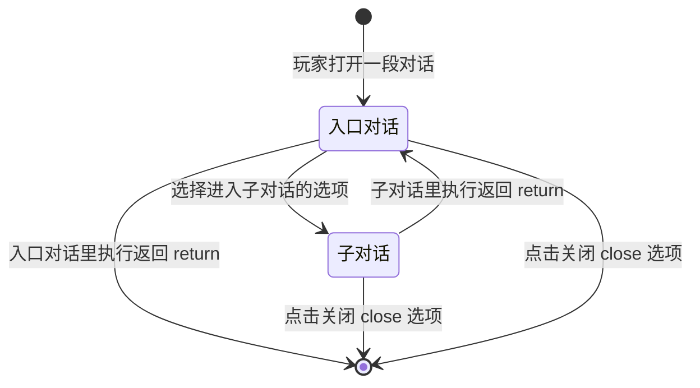

# 会话与导航

## 一次打开就是一场会话

玩家打开一段对话后，从看到第一句话到界面关闭，整个过程算**一次会话**。会话有几个固定规则：

- 打开时指定的那段对话是**入口对话**。整个会话期间入口不会改变。
- 从选项进入的子对话，读完内容后"返回（return）"，会**回到入口对话的开头重新播放**，而不是回到上一页。
- 系统没有"上一页"按钮，也没有记录每一步的历史位置。
- 界面关闭后，整场会话结束；再次打开会从入口重新开始。

## 会话导航图

## 三种结束方式

| 写法 | 在入口对话里 | 在子对话里 |
|---|---|---|
| 返回（return） | 关闭界面 | 回到入口对话开头，重新播放 |
| 关闭（close） | 直接关闭界面 | 直接关闭界面（不经过入口） |
| 进入另一段对话（dialogue） | 播放完当前结束页，玩家再按一次推进后进入目标对话 | 同左；目标对话检查通过才进入 |

注意：`close` 只能写在选项（Option）的 target 上，不能写在对话结尾的 `exit` 上。

## 其他与会话有关的规则

- **历史记录**只保留本次会话期间播放过的正文和已确认的选项。关闭界面、死亡、断线或被其他界面替换后，历史清空，不会写入存档。
- **玩家已经开着对话时**，新的打开请求会被忽略，不会替换当前界面。
- **服务端不保存播放进度**。玩家退出重进后，对话从入口重新开始，不会接着上次的位置。
- **跳过摘要**（长按跳过时出现的确认窗口）出现期间，画面可以自然播完，但所有操作都会被拦截，直到玩家确认或取消。

## 下一步

在对话文件里写这些导航规则的具体字段，见[Dialogue JSON 参考](../reference/dialogue-json.md)。玩家实际按键操作的行为，见[玩家操作](../publish/player-controls.md)。
