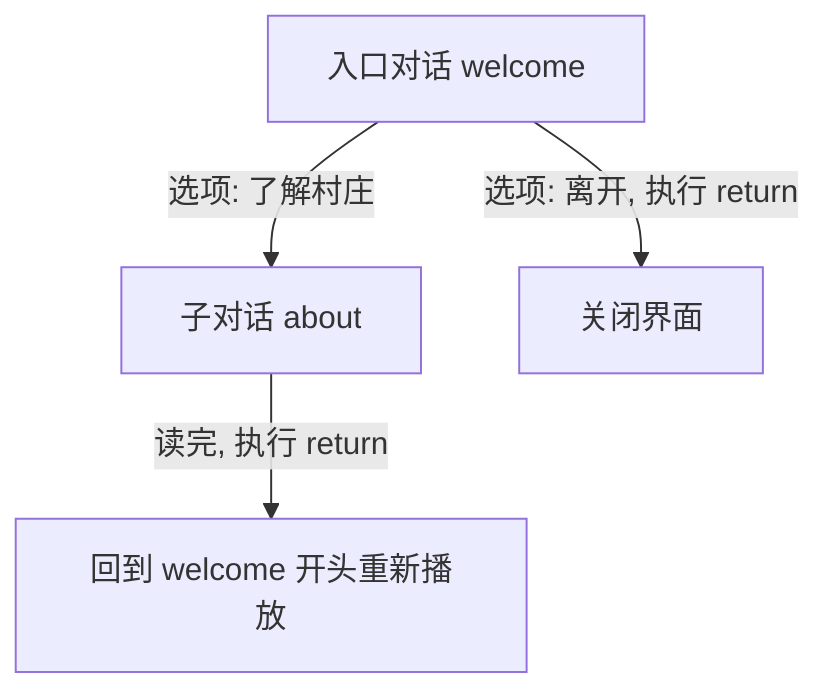

# 选项与子对话

## 本章要实现什么

`welcome` 的结束点会出现“了解村庄”和“离开”两个选项。玩家进入 `about` 后，读完内容会返回入口 Dialogue `welcome` 的开头。

## 开始前

你已经完成[Markdown 正文](./markdown.md)，并能正常显示 `example:guide/welcome`。

## 需要修改的文件

同步修改 `welcome`，并在资源包与数据包中各新增一份子 Dialogue：

```text
<资源包>/assets/example/dialogues/guide/welcome.json
<数据包>/data/example/dialogues/guide/welcome.json
<资源包>/assets/example/dialogues/guide/about.json
<数据包>/data/example/dialogues/guide/about.json
```

## 跟着做

1. 把 `welcome` 的结束方式从 `return` 改为两个选项。本章重点是高亮的 `exit`：

::: code-group

```json{4-24} [本章改动]
{
  "end": {
    "text": "请选择一个话题。",
    "exit": {
      "type": "options",
      "options": [
        {
          "text": "了解村庄",
          "icon": "question",
          "target": {
            "type": "dialogue",
            "dialogue": "example:guide/about"
          }
        },
        {
          "text": "离开",
          "target": {
            "type": "return"
          }
        }
      ]
    }
  }
}
```

```json:line-numbers {21-43} [完整 welcome.json]
{
  "presentation": {
    "theme": "maimai_dialogue:default"
  },
  "steps": [
    {
      "speaker": {
        "type": "set",
        "id": "example:guide"
      },
      "text": "# 欢迎来到村庄\n\n我是这里的 **向导**。"
    },
    {
      "text": "沿着 *石路* 向前，就能找到 `market`。"
    }
  ],
  "end": {
    "speaker": {
      "type": "hide"
    },
    "text": "请选择一个话题。",
    "exit": {
      "type": "options",
      "options": [
        {
          "text": "了解村庄",
          "icon": "question",
          "target": {
            "type": "dialogue",
            "dialogue": "example:guide/about"
          }
        },
        {
          "text": "离开",
          "target": {
            "type": "return"
          }
        }
      ]
    }
  }
}
```

:::

把完整 `welcome.json` 同步保存到两个 Pack。

这里出现了一个重要概念——入口对话：用命令直接打开的 `welcome` 就是这次会话的入口，整个会话期间它不会改变。`about` 里的 `return` 会回到入口 `welcome` 的开头重新播放；入口里的 `return` 才会关闭界面。系统没有"上一页"按钮。完整的会话规则见[会话与导航](../concepts/session.md)。



`icon` 是选项左侧的小图标，可选 `none`、`question`、`exclamation`、`dialogue`，省略时默认 `none`。

### 可选：点击时执行指令

Option 可以在执行原 `target` 前先运行一条或多条指令。例如接受任务后关闭入口 Dialogue：

```json
{
  "text": "接受任务",
  "command": [
    "tag @s add accepted_quest",
    "tellraw @s {\"text\":\"任务已接受\",\"color\":\"green\"}"
  ],
  "target": {
    "type": "return"
  }
}
```

`command` 可以省略，也可以写成一条 string；array 会从上到下依次执行。指令执行前会先检查 Dialogue 和 `target` 是否允许访问；通过后以点击玩家作为 `@s`、permission level 2 执行；任意一条失败都会停止后续指令并留在当前选项页，全部成功后才继续 `target`。已经成功的副作用不会回滚，因此奖励逻辑要能安全地重复调用；复杂或需要集中维护的流程仍建议放入 Data Pack function。

### 可选：从任意 Dialogue 直接关闭

`return` 在子 Dialogue 中会回到入口。如果这个选项应该直接结束整个对话，改用 `close`：

```json
{
  "text": "结束交谈",
  "target": {
    "type": "close"
  }
}
```

`close` 只能作为 Option target；它在入口和子 Dialogue 中都会直接关闭界面。Option 同时配置 `command` 时，仍然只有全部指令成功后才会关闭。

2. 创建 `about.json`。它是一段新的 Dialogue，因此下面高亮的是整个内容结构：

```json:line-numbers {2-14} [about.json]
{
  "presentation": {
    "theme": "maimai_dialogue:default"
  },
  "end": {
    "speaker": {
      "type": "set",
      "id": "example:guide"
    },
    "text": "这里以农田和集市闻名。",
    "exit": {
      "type": "return"
    }
  }
}
```

把 `about.json` 同步保存到资源包和数据包。选项的 Dialogue target 负责从 `welcome` 进入 `about`；`about` 的 Return 会回到本次入口 `welcome`。在入口 `welcome` 选择 Return 则会关闭界面。

### 可选：结束后进入下一个 Dialogue

如果不需要玩家选择，可以把 `end.exit` 直接写成 Dialogue target：

```json
{
  "end": {
    "text": "我们去集市看看吧。",
    "exit": {
      "type": "dialogue",
      "dialogue": "example:guide/market"
    }
  }
}
```

结尾页的文字和 blocking Action 全部播放完成后会停留在当前画面；玩家再次推进时进入 `market`。目标仍需同时存在于 Data Pack 与 Resource Pack，并通过 `requires` 检查；这个跳转不会改变本次会话的入口 Dialogue。

## 进入游戏验证

重载后打开 `example:guide/welcome`：

1. 推进到选项页；
2. 点击“了解村庄”；
3. 读完 `about` 并推进；
4. 确认重新回到 `welcome` 的开头；
5. 点击“离开”关闭界面。

## 如果没有生效

- 选项消失：确认数据包中存在目标 `data/example/dialogues/guide/about.json`。
- 点击后提示缺失：确认已启用的资源包中也存在同 ID 的 `about.json`。
- Return 直接关闭：检查最初是否确实打开了 `example:guide/welcome`。
- 选项文字没有 Markdown：这是正常行为，Option 使用普通文本。

## 下一步

继续[使用 Progress 条件](./progress.md)，让一个选项只在解锁后出现。
