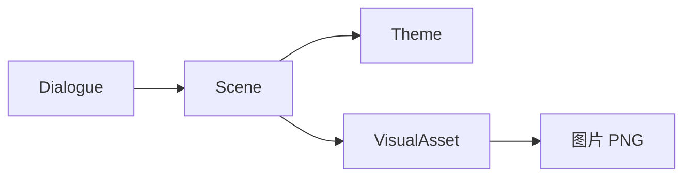

# 添加 VisualObject

## 本章要实现什么

先把 emerald 与 diamond 差分定义为可复用 VisualAsset，再在场景中央偏上位置创建一个 VisualObject，供下一章动画切换。

## 开始前

你已经完成[添加背景](./background.md)。本章继续使用 Minecraft 自带图片。

## 需要修改的文件

新增只属于资源包的 VisualAsset：

```text
<资源包>/assets/example/visual_assets/guide/marker.json
```

继续修改上一章创建的 Scene：

```text
<资源包>/assets/example/scenes/guide/welcome.json
```

并同步替换资源包与数据包中的 Dialogue：

```text
<资源包>/assets/example/dialogues/guide/welcome.json
<数据包>/data/example/dialogues/guide/welcome.json
```

## 跟着做

### Scene 与 VisualAsset 的分工

Dialogue 用字符串 `scene` 引用完整场景；Scene 保存背景、对象、滤镜、Theme 引用和对话框布局。VisualAsset 保存可复用的图片差分，Scene 中的对象决定它的位置和初始表情。



Scene 和 VisualAsset 只放在资源包中；Dialogue 同步到双包。不同资源类型可以使用相同 ID。修改共享 Scene 会影响所有引用它的 Dialogue，需要独立配置时复制 Scene，再修改 Dialogue 的引用。

### 创建视觉资源 marker.json

```json:line-numbers [visual_assets/guide/marker.json]
{
  "variants": {
    "default": "minecraft:item/emerald.png",
    "alternate": "minecraft:item/diamond.png"
  },
  "sampling": "nearest"
}
```

这个视觉资源的代号是 `example:guide/marker`。它做的事很简单：`variants` 给两张图片各起一个代号（`default`、`alternate`），`sampling: "nearest"` 让像素图放大后保持清晰（不模糊）。

接着修改场景文件 `scenes/guide/welcome.json`，保留上一章的背景，加入新的视觉对象（VisualObject）。`guide_marker` 是场景内的对象 ID，`asset` 指向刚才创建的视觉资源：

::: code-group

```json:line-numbers [scenes/guide/welcome.json]
{
  "background": {
    "variants": {
      "default": "minecraft:gui/title/background/panorama_0.png",
      "alternate": "minecraft:gui/title/background/panorama_1.png"
    },
    "initial_variant": "default",
    "fit": "cover",
    "opacity": 0.82
  },
  "visual_objects": {
    "guide_marker": {
      "asset": "example:guide/marker",
      "initial_variant": "default",
      "x": 0.5,
      "y": 0.3,
      "anchor": "center",
      "scale": 8.0,
      "opacity": 1.0,
      "visible": true,
      "z_index": 10
    }
  }
}
```

```json:line-numbers  [完整 dialogues/guide/welcome.json]
{
  "scene": "example:guide/welcome",
  "steps": [
    {
      "speaker": {
        "type": "set",
        "id": "example:guide"
      },
      "text": "# 欢迎来到村庄\n\n我是这里的 **向导**。"
    },
    {
      "text": "沿着 *石路* 向前，就能找到 `market`。"
    }
  ],
  "end": {
    "speaker": {
      "type": "hide"
    },
    "text": "请选择一个话题。",
    "exit": {
      "type": "options",
      "options": [
        {
          "text": "了解村庄",
          "icon": "question",
          "target": {
            "type": "dialogue",
            "dialogue": "example:guide/about"
          }
        },
        {
          "text": "询问秘密地点",
          "icon": "exclamation",
          "target": {
            "type": "dialogue",
            "dialogue": "example:guide/secret"
          }
        },
        {
          "text": "离开",
          "target": {
            "type": "return"
          }
        }
      ]
    }
  }
}
```

:::

把视觉资源、场景和场景文件只保存到资源包，并把引用场景文件的完整对话同步保存到两个 Pack。

视觉对象（VisualObject）的几个常用字段：

| 字段 | 含义 |
|---|---|
| `x`、`y` | 对象的位置，用画面比例表示，范围 `[0,1]`（0.5 是正中间，0.3 是离顶部约三成处） |
| `anchor` | 对象的哪个点对准 `x`/`y` 位置（`center` 是中心点，还有九宫格的其他 8 个值，见[Scene JSON 参考](../reference/scene-json.md#visualobject-视觉对象)） |
| `scale` | 放大倍数，`8.0` 表示放大 8 倍 |
| `scale_x`、`scale_y` | 分别控制水平／垂直方向的额外缩放，默认都为 `1.0`；实际尺寸还会乘以 `scale` |
| `opacity` | 不透明度，`0` 全透明，`1` 不透明 |
| `visible` | 是否显示，`false` 时隐藏 |
| `z_index` | 层级，数值越大画得越靠前 |

视觉对象省略 `sampling` 时会沿用视觉资源的设置（本例为 `nearest`），避免像素图放大后变模糊。

## 进入游戏验证

<!-- TODO(截图): 背景全景图 + 放大 emerald 标记的界面，标注对象位于水平中央、约三成高度 -->

重载后打开 `example:guide/welcome`。背景前方应出现放大的 emerald；它位于画面水平中央、约三成高度处。

## 如果没有生效

- 对象完全不显示：依次检查对话引用的场景文件 ID、场景文件里的 `scene` ID，再检查 `asset` ID、`visible`、`initial_variant` 和图片 ID。
- 图片模糊：在视觉资源里将 `sampling` 设为 `nearest`，或在单个视觉对象里覆盖它。
- 对象位置异常：先使用 `anchor: center`，再调整 `x`、`y`。
- 对象 ID 使用了 `background` 或 `dialogue`：这两个名称是保留 target，不能作为视觉对象 ID。

## 下一步

继续[播放 SceneAction](./actions.md)，让 emerald 入场并切换为 diamond。
