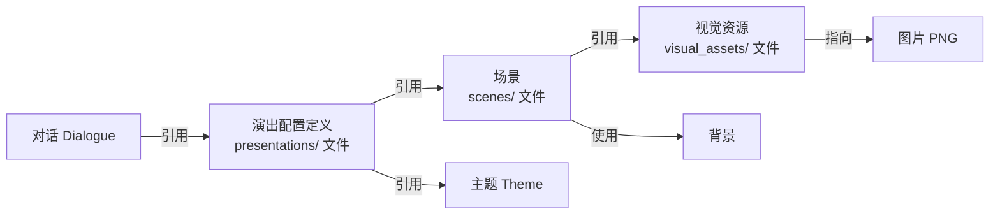

# 添加 VisualObject

## 本章要实现什么

先把 emerald 与 diamond 差分定义为可复用 VisualAsset，再在场景中央偏上位置创建一个 VisualObject，供下一章动画切换。

## 开始前

你已经完成[添加背景](./background.md)。本章继续使用 Minecraft 自带图片。

## 需要修改的文件

新增只属于资源包的 VisualAsset：

```text
<资源包>/assets/example/visual_assets/guide/marker.json
```

再新增一个只属于资源包的 Scene：

```text
<资源包>/assets/example/scenes/guide/welcome.json
```

最后新增一个只属于资源包的 Presentation：

```text
<资源包>/assets/example/presentations/guide/welcome.json
```

并同步替换资源包与数据包中的 Dialogue：

```text
<资源包>/assets/example/dialogues/guide/welcome.json
<数据包>/data/example/dialogues/guide/welcome.json
```

## 跟着做

### 先理解：为什么要拆成三个文件

上一章把背景直接写在了对话里。现在要让背景被复用、要放立绘、要挂动画，如果全部塞进对话文件，每段对话都要抄一遍，改起来也很麻烦。所以本章把画面拆成三个独立文件，各管一件事：

| 文件 | 类型 | 管什么 |
|---|---|---|
| `visual_assets/guide/marker.json` | 视觉资源（VisualAsset） | 给一张或多张图片（差分）起代号。相当于图片登记表，只登记，不决定位置 |
| `scenes/guide/welcome.json` | 场景（Scene） | 一套画面组合：背景 + 视觉对象 + 滤镜。相当于"这一场戏用什么布景" |
| `presentations/guide/welcome.json` | 演出配置定义（PresentationDefinition） | 一段对话的显示方案：用哪个主题、哪个场景、对话框放哪 |

它们和对话的关系是：



这三个文件都只放进资源包，不需要数据包副本；只有对话文件本身需要双端同步。

**什么时候可以不用拆？** 只在这一段对话里用一次、不需要复用、不需要动画的对象，继续直接把 `variants` 写在对话里就行，不必建文件。拆分是为复用服务的：同一个视觉资源可以被任意多个对话引用，每次引用可以选不同的初始差分、位置、缩放和层级；同一个场景可以被多个演出配置定义引用，需要额外角色时可以在演出配置里补充视觉对象（与场景里同名的对象会由演出配置里的那份替换）；同一个演出配置定义可以被多个对话引用，统一它们的主题、场景和对话框布局。

### 创建视觉资源 marker.json

```json:line-numbers [visual_assets/guide/marker.json]
{
  "variants": {
    "default": "minecraft:item/emerald.png",
    "alternate": "minecraft:item/diamond.png"
  },
  "sampling": "nearest"
}
```

这个视觉资源的代号是 `example:guide/marker`。它做的事很简单：`variants` 给两张图片各起一个代号（`default`、`alternate`），`sampling: "nearest"` 让像素图放大后保持清晰（不模糊）。

接着创建场景文件 `scenes/guide/welcome.json`，把上一章直接写在对话里的背景，和新的视觉对象（VisualObject）集中放进去。`guide_marker` 是场景内的对象 ID，`asset` 指向刚才创建的视觉资源：

::: code-group

```json:line-numbers [scenes/guide/welcome.json]
{
  "background": {
    "variants": {
      "default": "minecraft:gui/title/background/panorama_0.png",
      "alternate": "minecraft:gui/title/background/panorama_1.png"
    },
    "initial_variant": "default",
    "fit": "cover",
    "opacity": 0.82
  },
  "visual_objects": {
    "guide_marker": {
      "asset": "example:guide/marker",
      "initial_variant": "default",
      "x": 0.5,
      "y": 0.3,
      "anchor": "center",
      "scale": 8.0,
      "opacity": 1.0,
      "visible": true,
      "z_index": 10
    }
  }
}
```

```json:line-numbers [presentations/guide/welcome.json]
{
  "theme": "maimai_dialogue:default",
  "scene": "example:guide/welcome"
}
```

```json:line-numbers {3-4} [完整 dialogues/guide/welcome.json]
{
  "presentation": {
    "type": "reference",
    "id": "example:guide/welcome"
  },
  "steps": [
    {
      "speaker": {
        "type": "set",
        "id": "example:guide"
      },
      "text": "# 欢迎来到村庄\n\n我是这里的 **向导**。"
    },
    {
      "text": "沿着 *石路* 向前，就能找到 `market`。"
    }
  ],
  "end": {
    "speaker": {
      "type": "hide"
    },
    "text": "请选择一个话题。",
    "exit": {
      "type": "options",
      "options": [
        {
          "text": "了解村庄",
          "icon": "question",
          "target": {
            "type": "dialogue",
            "dialogue": "example:guide/about"
          }
        },
        {
          "text": "询问秘密地点",
          "icon": "exclamation",
          "target": {
            "type": "dialogue",
            "dialogue": "example:guide/secret"
          }
        },
        {
          "text": "离开",
          "target": {
            "type": "return"
          }
        }
      ]
    }
  }
}
```

:::

把视觉资源、场景和演出配置定义只保存到资源包，并把引用演出配置定义的完整对话同步保存到两个 Pack。

视觉对象（VisualObject）的几个常用字段：

| 字段 | 含义 |
|---|---|
| `x`、`y` | 对象的位置，用画面比例表示，范围 `[0,1]`（0.5 是正中间，0.3 是离顶部约三成处） |
| `anchor` | 对象的哪个点对准 `x`/`y` 位置（`center` 是中心点，还有九宫格的其他 8 个值，见[Presentation JSON 参考](../reference/presentation-json.md#visualobject)） |
| `scale` | 放大倍数，`8.0` 表示放大 8 倍 |
| `opacity` | 不透明度，`0` 全透明，`1` 不透明 |
| `visible` | 是否显示，`false` 时隐藏 |
| `z_index` | 层级，数值越大画得越靠前 |

视觉对象省略 `sampling` 时会沿用视觉资源的设置（本例为 `nearest`），避免像素图放大后变模糊。

## 进入游戏验证

重载后打开 `example:guide/welcome`。背景前方应出现放大的 emerald；它位于画面水平中央、约三成高度处。

## 如果没有生效

- 对象完全不显示：依次检查对话的演出配置定义 ID、演出配置里的 `scene` ID，再检查 `asset` ID、`visible`、`initial_variant` 和图片 ID。
- 图片模糊：在视觉资源里将 `sampling` 设为 `nearest`，或在单个视觉对象里覆盖它。
- 对象位置异常：先使用 `anchor: center`，再调整 `x`、`y`。
- 对象 ID 使用了 `background` 或 `dialogue`：这两个名称是保留 target，不能作为视觉对象 ID。

## 下一步

继续[播放 SceneAction](./actions.md)，让 emerald 入场并切换为 diamond。
