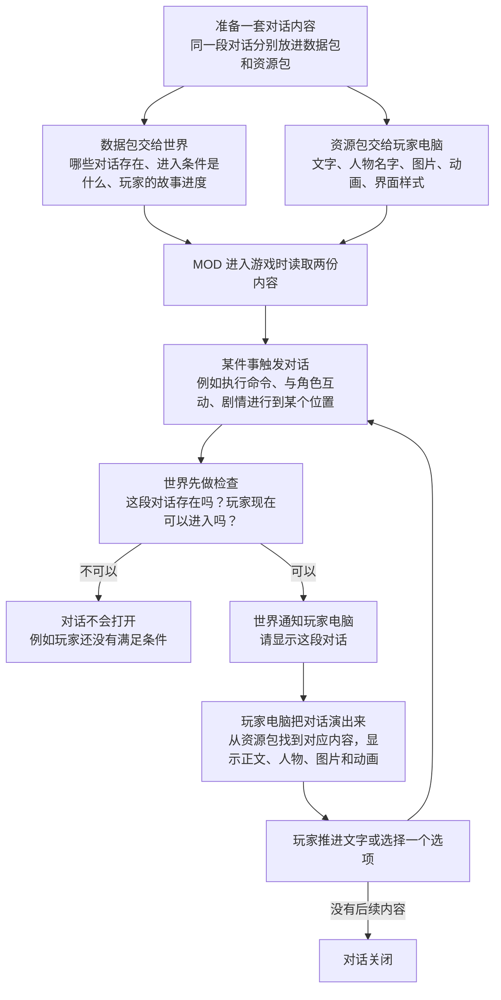

# MOD 是怎样工作的

对话的运行分成两条路：**数据包（Data Pack）**决定这段内容"什么时候可以发生"，**资源包（Resource Pack）**决定"玩家看到和听到什么"。玩家实际看到对话之前，要经过下面这套流程：

::: tip 只要记住三件事
- 数据包决定"这段内容现在能不能发生"。
- 资源包决定"玩家看到和听到什么"。
- 两边用同一个对话代号找到彼此，所以修改对话时要同步更新两份文件。
:::

单人游戏也遵循这套流程，只是"世界"和"玩家电脑"都运行在你的电脑上。下一章会带你创建这两个 Pack。

[下一步：创建内容包 →](./content-project.md)
