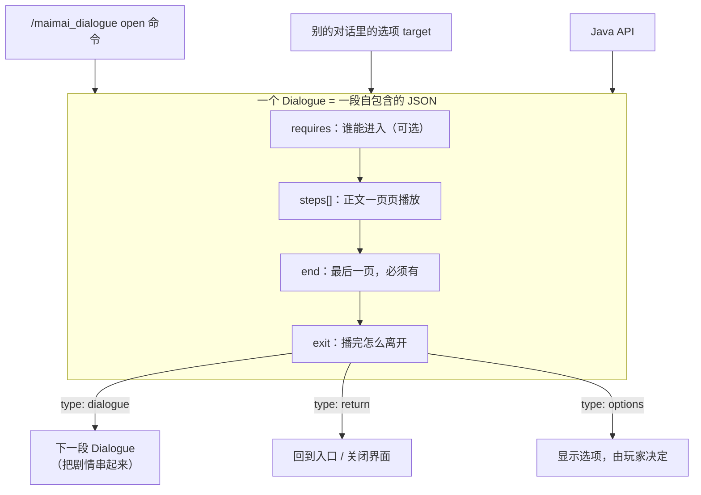
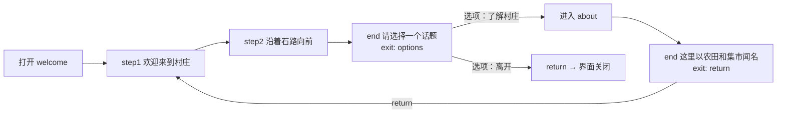

# 认识 Dialogue

## Dialogue 是一段独立的剧情单元

在 MaiMai Dialogue 里，一段对话（Dialogue）就是一个 JSON 文件。它把一段剧情需要的所有信息装在一起：

- **谁能进入**：可选的 `requires` 条件（比如玩家已完成某个任务节点）；
- **正文怎么播**：`steps` 数组按顺序播放每一页文字，最后是必填的 `end` 结尾页；
- **播完怎么离开**：`end.exit` 决定结局——返回、关闭，或者用选项让玩家选择下一站。

一个 Dialogue 自成一个单元：它不依赖游戏代码，可以被任何入口直接打开——命令、其他对话里的选项、任务 MOD 的 API。写一次，就能在多处进入它。

## Dialogue 能做什么

围绕这一个单元，MOD 提供了这些能力，每一条都会在后面的教程里逐一实现：

- 多页正文，带打字机效果，逐页推进（[步骤与推进](../dialogue/steps.md)）
- 每页从几句候选里随机抽一句（[步骤与推进](../dialogue/steps.md)）
- 显示说话者名称，随剧情切换或隐藏（[显示 Speaker](../dialogue/speaker.md)）
- 正文支持 Markdown：标题、粗体、列表、引用（[编写 Markdown 正文](../dialogue/markdown.md)）
- 结尾显示选项，进入子对话或结束（[选项与子对话](../dialogue/choices.md)）
- 用进度节点控制整段对话或单个选项的可见性（[Progress 条件](../dialogue/progress.md)）
- 点击选项时顺带执行指令（[选项与子对话](../dialogue/choices.md)）
- 绑定一套画面：主题、背景、立绘、动画（[制作画面](../scene/background.md)）

下面的流程图就是[第一段对话](./first-dialogue.md)及后续章节会做出来的真实流程：`welcome` 用选项进入 `about`，`about` 读完再回到 `welcome` 开头：

## 为什么用 JSON 文件而不是写代码

Dialogue 以及它的画面（说话者、主题、背景、立绘、动画）全部由 JSON 资源文件描述。你只需要创建文件和编辑 JSON，MOD 负责把它们组合播放。这意味着：

- 修改剧情不需要重新编译任何东西——保存文件、在游戏里重载，马上就能看到效果；
- 同样的文件随整合包分发，玩家装上就能玩到。

## 为什么同一段对话要写两份

Minecraft 的内容装在两个包里，两个包各回答一个问题：

- **数据包（Data Pack）**回答"**现在能不能看**"：这段对话存在吗、进入条件满足吗。
- **资源包（Resource Pack）**回答"**看到什么**"：正文、说话者、图片、动画和界面样式。

所以每一段 Dialogue 都要写两份内容相同的 JSON：一份进数据包，一份进资源包，两边用同一个资源 ID 对上。单人游戏里两个包都在你的电脑上；多人游戏里数据包放在服务器所在的世界，资源包放在每个玩家的客户端。

::: tip 只要记住三件事
- 数据包决定"现在能不能看"。
- 资源包决定"看到什么"。
- 两边用同一个资源 ID 对上，所以修改对话时要同步更新两份文件。
:::

两份对不上时，玩家能看到的现象是：

- 只有数据包、没有资源包：命令提示已打开，但界面上什么都没有；
- 只有资源包、没有数据包：打开命令直接报"Dialogue 不存在"；
- 两份内容不同：条件按数据包判断、画面按资源包显示，可能出现"选项显示出来了、点了却没反应"。

除了 Dialogue 需要两份，其余文件（说话者、主题、演出配置、场景、视觉资源、动画、图片）只放进资源包。每类文件放在哪个目录，见[资源路径与 ID](../reference/resource-paths.md)。

## 下一步

[创建内容包 →](./content-project.md)，把这两个 Pack 的目录建出来。
